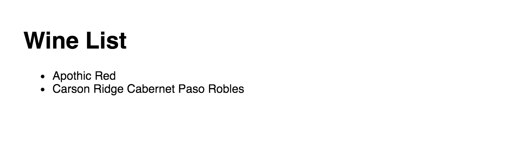
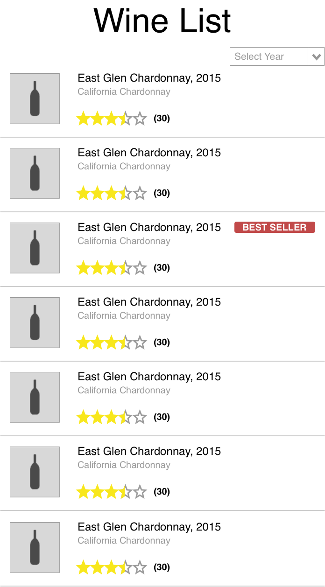

# Smashing Boxes Front-End Test (React)

In order to help us better understand whether we can be a great fit for you, we would like you to take this coding challenge.
We respect your time, so we have scoped the challenge to the minimum we could to gauge your abilities.
We don't ask you to do anything here that you wouldn't need to do on an average day at Smashing Boxes.
There's no tricky math or gotchas.

In this boilerplate, you will find many of the tools we use every day.
This code challenge uses React and Redux.
These libraries are our preferred way to handle the logic for apps these days.
Also included is SASS, one of our preferred CSS preprocessors.

You might be new to React. In that case -- don't worry! Our recruiting team is viewing this test as a measure of how quickly you can pick up and work in this new library (and of course, follow instructions). We're not necessarily looking to make a strict measure of the quality of your code or your knowledge of this library itself.

Some handy links to documentation:
- https://facebook.github.io/react/docs/hello-world.html
- http://redux.js.org/

Setting up a front-end project can easily take more time than this task itself.
Recognizing that, we've set everything up for you.
After all, you're not expected to be standing up brand new projects every day.
Follow the instructions below to get this up and running.

And of course, if you experience any problems, feel free to open issues on this repo.

## Setup

Required software:
- Node.js
- NPM
- Git

To get started, clone down this repo. Run this command from your terminal / command line:

```
git clone git@github.com:smashingboxes/front-end-test-react.git
```

Move into the directory and install the dependencies.

```
cd front-end-test-react
npm install
```

At this point, your app is ready to go!
To start the server, just run

```
npm start
```

You can access it at `localhost:8080`.

## Exercise

In this exercise, you will build a list of wines for us.
It's similar to what you might see in a typical e-commerce app.
Oh, and we're big fans of the stuff.
So classy!

You should start with a two item wine list like below.



We would like you to complete these things:

1. instead of using the wine list on the client, fetch the list of wines from `localhost:8080/api/v1/wines`.
2. style the wine list to match this spec:

  

3. implement features for each wine
  - if it has the most units sold, it should have a badge reading "BEST SELLER"
  - it should have an average star rating indicator with a count of all ratings
  - it should have a placeholder image
4. implement the years select box
  - it should contain an item with the words "Select Year" that when selected shows all wines
  - it should contain an ascending ordered list of all years (vintages) of all the wines
  - whenever the selection changes, the list of wines is updated to only those wines from that vintage
  - **the year select box does not need to be styled like the spec—that's literally the toughest task in front-end development**

## What we look for

One of our core values at Smashing Boxes is being open, and for the sake of transparency we're telling you exactly what we look for.

- your code should be simple and well-written
- your code should be modular
- your code should have no obvious performance problems or bugs
- your styles should be reasonably close to spec
- your styles should look good across a variety of device form factors
- your page should work on Chrome and Firefox

Bonus points

- writing good documentation around your choices
- creating tests to go along with your code
- committing often so we can get a feel for how you've worked through the problem

## Wrap up

Good luck on this test!
We're excited to see what you come up with.
In order to submit your test, please open a pull request against this repo.
Then notify the recruiter you are working with that you have completed the test.

If you have any questions, please reach out to our recruiter and that person should be able to get you in contact with someone who can help.

## APPENDIX

### Wine data structure

```
{
  "id": UUID (String),
  "name": String,
  "vintage": String,
  "vineyard": String,
  "type": String,
  "region": String,
  "unitsSold": Number,
  "ratings": [Rating]
}
```

### Rating data structure

```
{
  "stars": Number
}
```
